
<h1 align="center">基于Java的微博网站的设计与实现+vue</h1>

## 简介
微博网站：角色分为管理员、用户；功能包括用户管理、公告信息管理、文章管理、论坛管理、留言管理和个人信息管理。    --计算机毕业设计源码；毕设源码；java毕业设计源码

## 联系方式

<h3 align="center">获取完整代码与数据库文件 + 微信：deepguan QQ: 86050149 QQ群: 783742310</h3>

<h3 align="center">可帮忙远程部署 包运行成功！提供远程部署、修改代码、设计文档指导、代码讲解等服务！</h3>

## 功能介绍（完整见运行截图）
管理员： 管理员可以通过登录界面进入系统，并具有退出功能。系统提供文章、公告信息、论坛等内容的管理功能，包括文章的详细查看、修改、删除及上下架操作。公告信息管理允许创建和查询公告，查看类型和发布信息。管理员可以管理用户信息，并通过后台管理界面查看和回复用户留言、帖子评论，以及处理用户角色权限等。论坛管理包括帖子的发布与回复管理，提供帖子、回帖详细查看和操作选项。个人中心提供管理员个人信息查看和修改。

用户： 用户可以通过注册和登录界面进入系统，并选择普通用户身份。在网站首页，用户可以浏览论坛、公告信息和文章，查看详细信息并参与互动。用户可以发布新的论坛帖子，也可以对现有帖子进行评论和点赞。个人中心允许用户查看和编辑个人信息，包括账户、手机号及邮箱等信息。用户还可以管理自己的收藏，查看已收藏的文章，进行删除或查看详情操作。留言功能支持用户在文章下或特定板块中发表留言，与其他用户交流。

## 运行截图
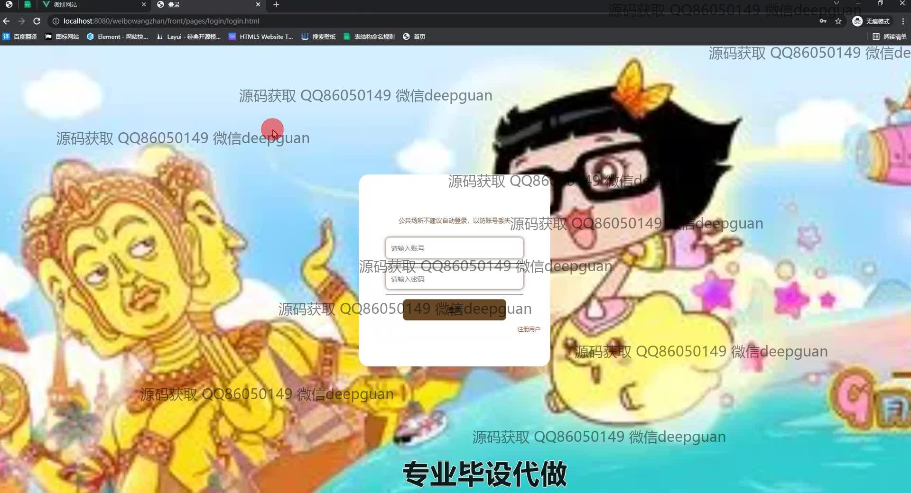
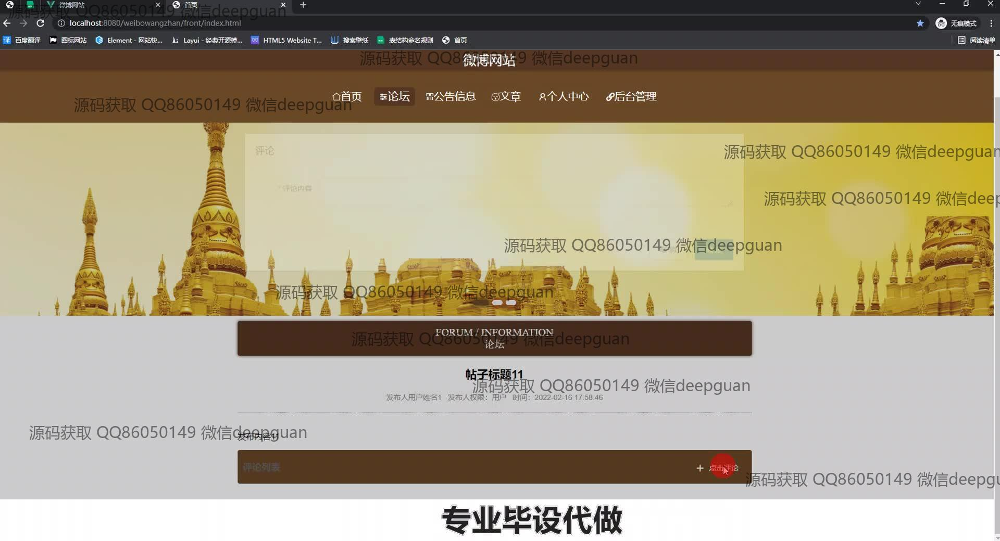
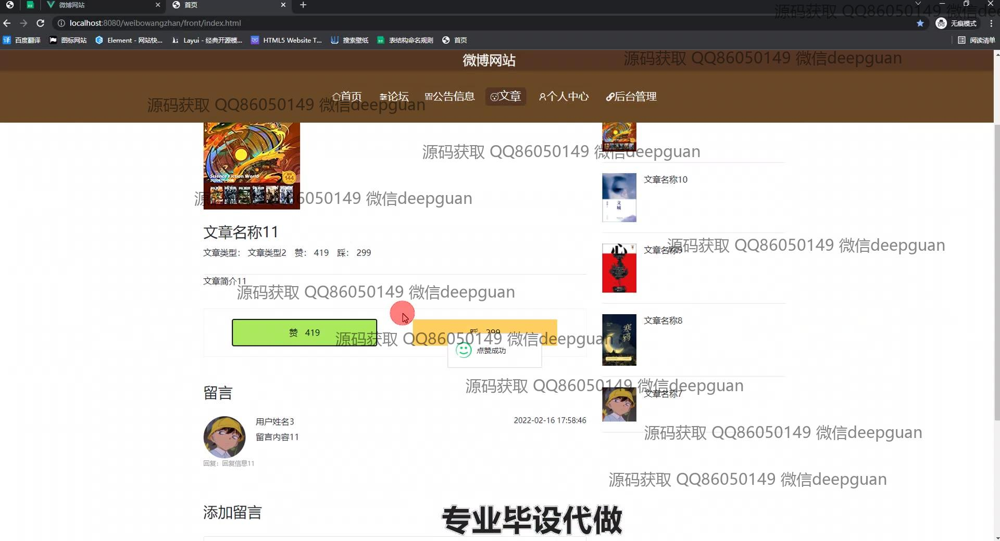
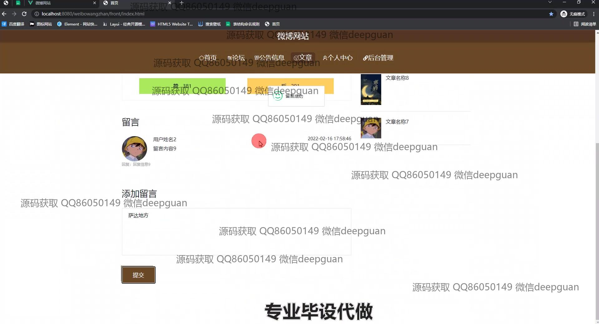
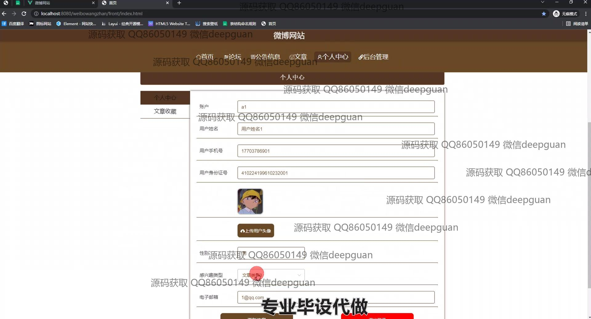
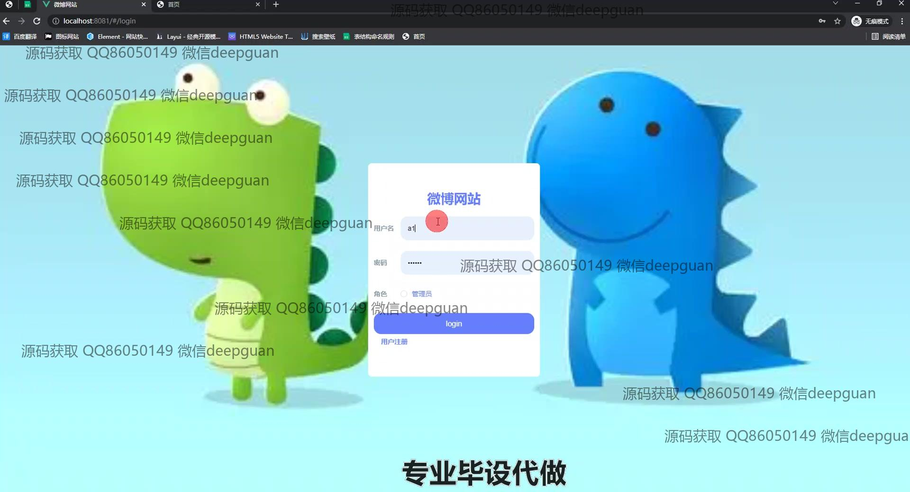
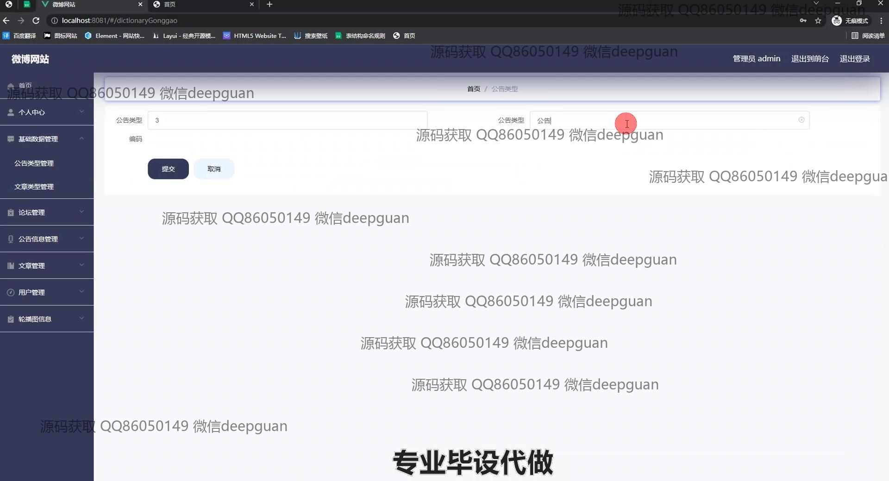
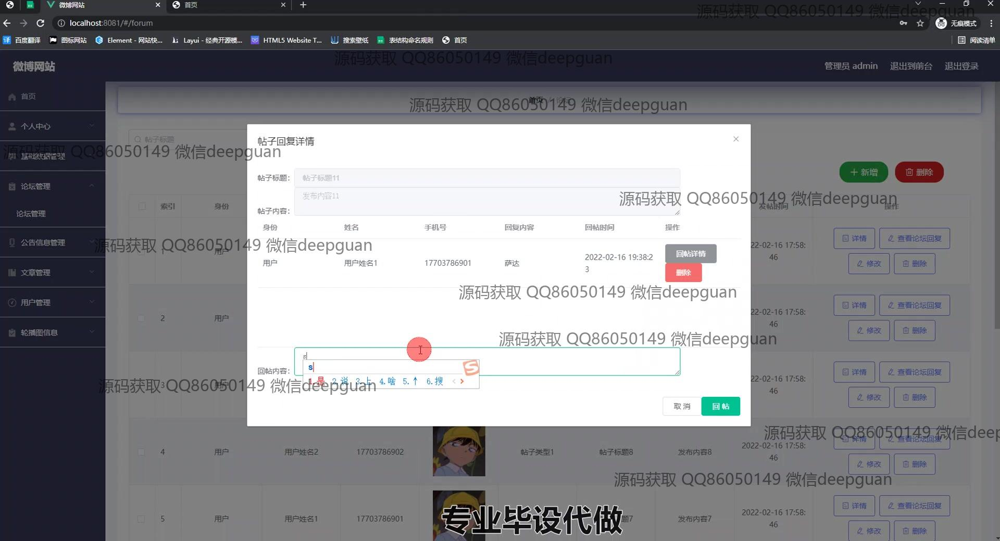
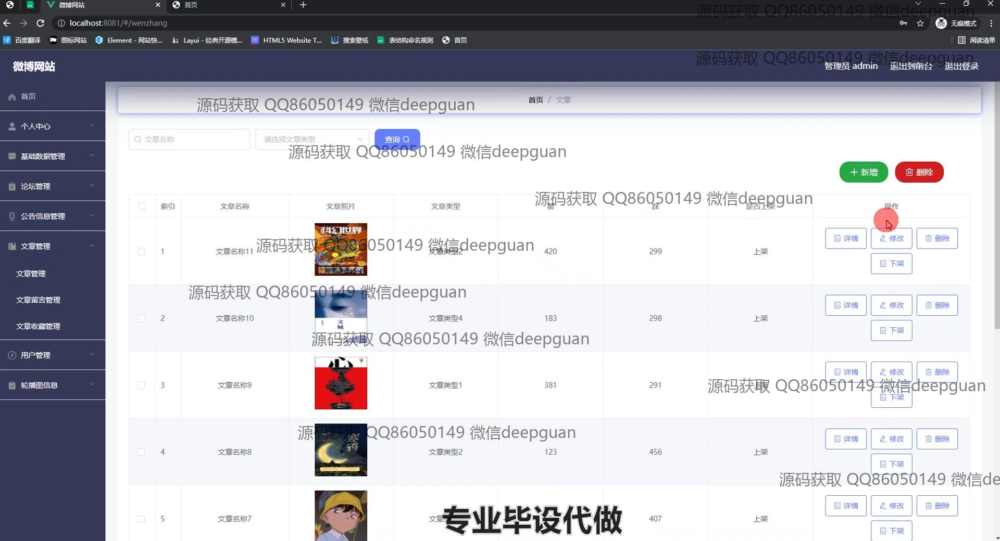
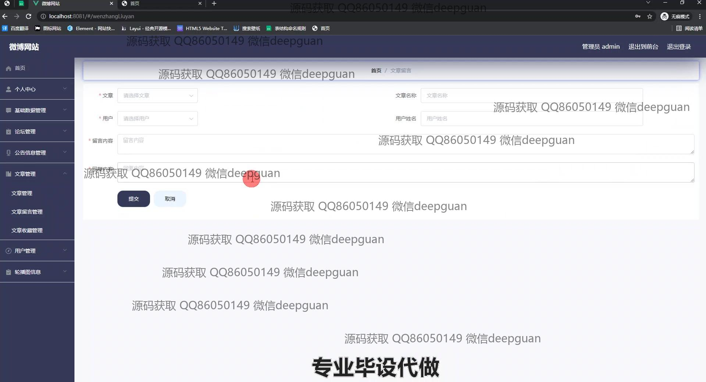
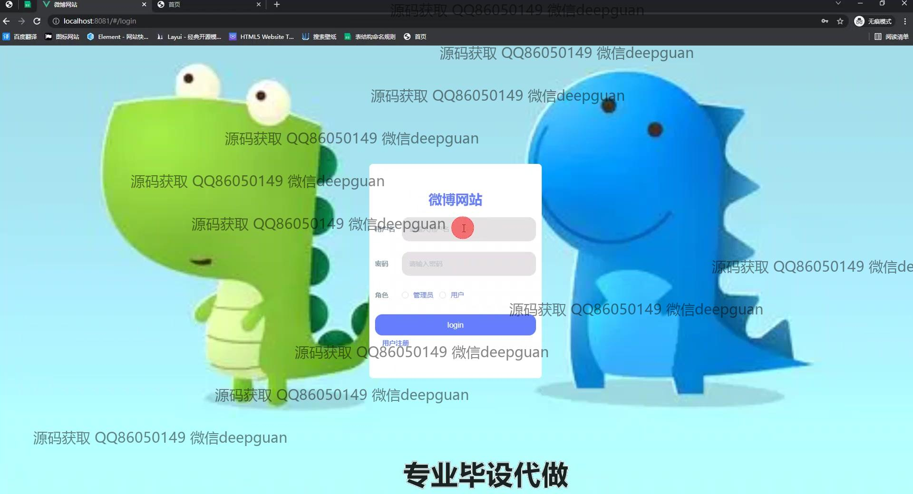
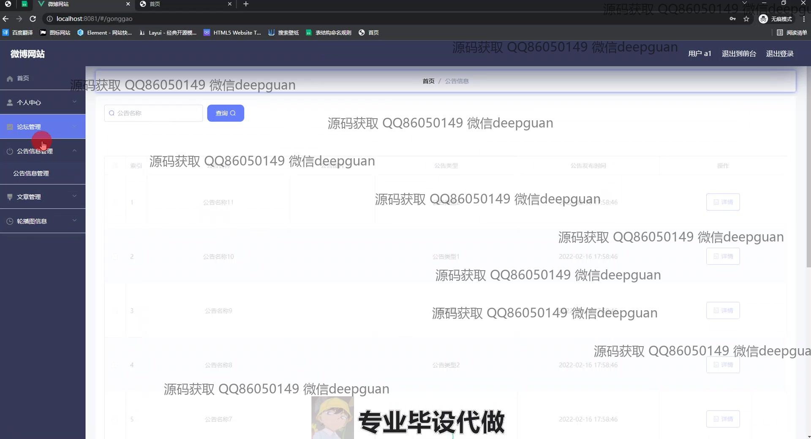
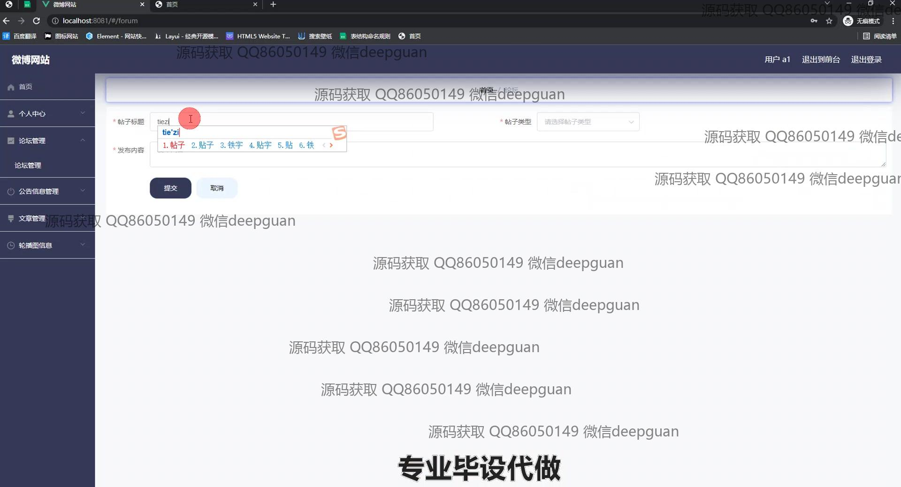
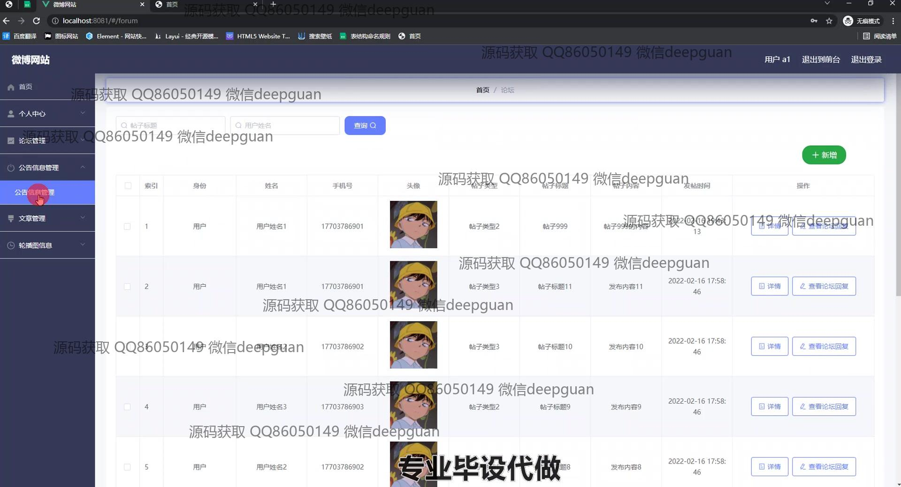
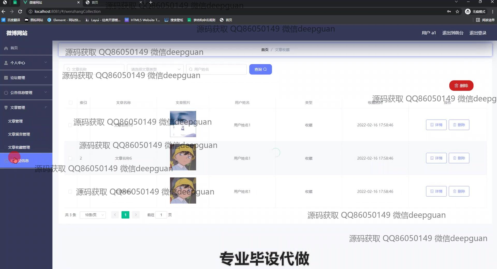

本代码来源于网络,仅供学习参考使用!

